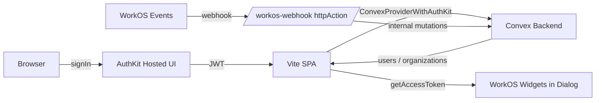

# Clerk → WorkOS Migration Plan

## Architecture



## Decisions Already Locked In
- All existing Convex domain rows (agents, textEntries, fileEntries, webEntries, qaEntries, conversations) will be wiped via a one-time internal mutation. No Clerk-ID backfill.
- Members/admins are populated from a WorkOS webhook handler (`organization_membership.*`, `user.*`).
- Existing tables keep `userId: v.string()` / `orgId: v.string()` — those columns just start holding WorkOS IDs. New `users` / `organizations` tables sit alongside; existing tables are not converted to `Id<"users">` foreign keys (out of scope; can be done later).

## Files Touched

### Backend (Convex)

- `convex/schema.ts` — add `users` and `organizations` tables.
- `convex/authUtils.ts` — read `org_id` and `role` claims from the WorkOS JWT (currently only reads `o.id`, which was Clerk-shaped); add `getOrCreateUser` helper.
- `convex/users.ts` (new) — `getUsers` query that returns the user docs for everyone in the caller's active organization (resolves `organizations.members` to `users` rows), plus an internal upsert mutation used by webhooks.
- `convex/organizations.ts` (new) — `getOrganization` query (returns the caller's active org with `members`/`admins`), plus internal mutations for webhook-driven sync.
- `convex/http.ts` (new) — `httpRouter` exposing `POST /workos-webhook`.
- `convex/workosWebhook.ts` (new) — `httpAction` that verifies the WorkOS signature with `@workos-inc/node` (`workos.webhooks.constructEvent`), then dispatches to internal mutations. Idempotent on `event.id`.
- `convex/_resetDevData.ts` (new, internal-only) — one-shot internal mutation to delete all rows in domain tables. Run once via `npx convex run`.
- `package.json` — managed exclusively via `bun` (project already has `bun.lock`). Adds: `bun add @workos-inc/node @workos-inc/widgets`. Removes: `bun remove @clerk/react`. (`convex/react-clerk` is a subpath of `convex` and removed by deleting its imports.)

### Frontend (React / Vite)

- `src/main.tsx` — replace `ClerkProvider` + `ConvexProviderWithClerk` with `AuthKitProvider` + `ConvexProviderWithAuthKit` (from `@convex-dev/workos`). Add a `/login` route that calls `signIn()` per the AuthKit-React README.
- `src/App.tsx` — replace `<SignIn />` with a centered card that calls `useAuth().signIn()`.
- `src/components/app-sidebar.tsx` — replace `<UserButton>` with a custom `<UserFooter>` button that opens `AccountDialog`. Position and surrounding markup stay identical.
- `src/pages/WorkspacePage.tsx` — same swap inside `AgentsSidebar`; replace `useAuth().orgId` (Clerk) with `useAuth().organizationId` (AuthKit). Drive `agents` list by Convex `organizations.getMine` instead of a raw string.
- `src/pages/CreateAgentPage.tsx` — replace `useAuth().orgId` with AuthKit `organizationId`.
- `src/layouts/DashboardLayout.tsx` — same `orgId` source swap.
- `src/components/AccountDialog.tsx` (new) — Radix Dialog with two tabs (Profile / Members) hosting `<UserProfile />` and `<UserManagement />` from `@workos-inc/widgets`. Fetches a fresh `accessToken` via `getAccessToken()` on dialog open and refreshes when the token nears expiry.

### Config / Env

- `.env.local` — add `VITE_WORKOS_CLIENT_ID`, `VITE_WORKOS_REDIRECT_URI`. Remove `VITE_CLERK_PUBLISHABLE_KEY`.
- Convex deployment env (set via `npx convex env set`):
  - `WORKOS_CLIENT_ID` (already present per `convex/auth.config.ts`)
  - `WORKOS_API_KEY`
  - `WORKOS_WEBHOOK_SECRET`
- WorkOS Dashboard:
  - Redirect URI: `http://localhost:5173` (+ prod URL)
  - Sign-in endpoint: `http://localhost:5173/login`
  - Allowed origins: `http://localhost:5173`
  - Webhook endpoint: `<convex-deployment>.convex.site/workos-webhook`, subscribed to `user.created`, `user.updated`, `user.deleted`, `organization_membership.created`, `organization_membership.updated`, `organization_membership.deleted`, `organization.created`, `organization.updated`, `organization.deleted`.
  - Roles & Permissions: confirm the Admin role includes `widgets:users-table:manage` (User Management widget requires it).

## Schema Sketch

```ts
users: defineTable({
  workosUserId: v.string(),
  email: v.string(),
  firstName: v.optional(v.string()),
  lastName: v.optional(v.string()),
  profilePictureUrl: v.optional(v.string()),
  createdAt: v.number(),
  updatedAt: v.number(),
})
  .index("by_workosUserId", ["workosUserId"])
  .index("by_email", ["email"]),

organizations: defineTable({
  workosOrgId: v.string(),
  name: v.string(),
  members: v.array(v.id("users")),
  admins: v.array(v.id("users")),
  createdAt: v.number(),
  updatedAt: v.number(),
}).index("by_workosOrgId", ["workosOrgId"]),
```

## Webhook Handler Behavior

Per WorkOS Events guidance (5s ack, raw body for signature verify, idempotent on `event.id`):

- `user.created` / `user.updated` → upsert `users` by `workosUserId`.
- `user.deleted` → delete `users` row + scrub the user's id from every org's `members`/`admins` arrays.
- `organization.created` → upsert `organizations` row (empty `members`/`admins`).
- `organization.updated` → patch `name`.
- `organization.deleted` → delete row.
- `organization_membership.created` / `updated` → ensure `users` row exists (upsert minimally if not), then add `Id<"users">` to `members`; if `role.slug === "admin"`, also add to `admins`. Remove from `admins` when role drops.
- `organization_membership.deleted` → remove user id from both arrays.

A small dedupe table (`processedEvents` indexed by `eventId`) makes retries safe.

## AccountDialog Sketch

- Trigger: the existing sidebar avatar button (no positional change — same `SidebarMenuButton` slot).
- Inside Dialog, a `Tabs` component with two tabs:
  - **Profile** → `<UserProfile authToken={accessToken} />`
  - **Members** → `<UserManagement authToken={accessToken} organizationId={organizationId} />`, hidden if `organizationId` is null
- Token lifecycle: on dialog open, call `getAccessToken()`; store in local state. Tokens last ~1h, well past dialog session length.
- A small "Sign out" button at the bottom calls `useAuth().signOut()`.

## Order of Execution

1. Install / remove dependencies via **bun only** (`bun add @workos-inc/node @workos-inc/widgets`, `bun remove @clerk/react`). Never edit `package.json` by hand or use `npm`/`yarn`/`pnpm` for this project.
2. Update `convex/schema.ts` + ship the dev-data reset internal mutation; run it once.
3. Land the webhook handler (`convex/http.ts`, `convex/workosWebhook.ts`) and configure WorkOS dashboard webhook + `WORKOS_WEBHOOK_SECRET`.
4. Update `convex/authUtils.ts` to read AuthKit JWT claims (`org_id`, `role`).
5. Swap providers in `src/main.tsx`, replace `<SignIn />` in `src/App.tsx`, add `/login` route.
6. Swap `useAuth().orgId` call sites (3 files) to AuthKit's `organizationId`. Where the dashboard previously read `agents` via the raw `orgId` string, point it at the new `organizations.getOrganization` / `users.getUsers` queries when org context is needed.
7. Build `AccountDialog` and slot it into both sidebars.
8. Smoke test: sign in → land on `/workspace` → open dialog → see profile + members.

## Out of Scope (call out so it's explicit)

- Migrating existing tables' `orgId`/`userId` columns to `Id<"organizations">` / `Id<"users">` foreign keys.
- Importing Clerk users into WorkOS (data is wiped per the user's choice).
- Production deployment of the WorkOS configuration (this plan covers local-dev wiring; prod URLs/redirects can be added in the same files later).
